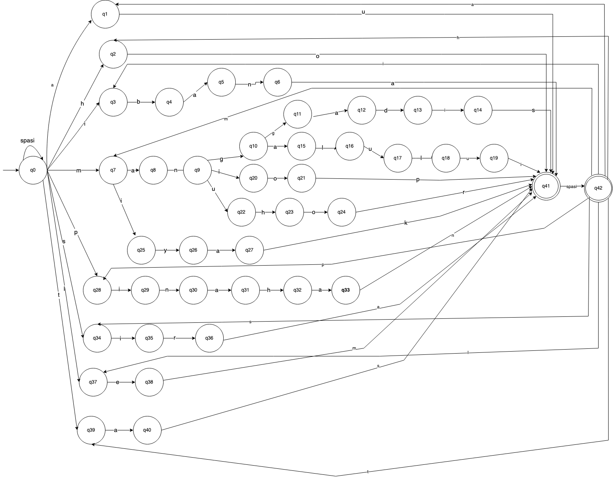
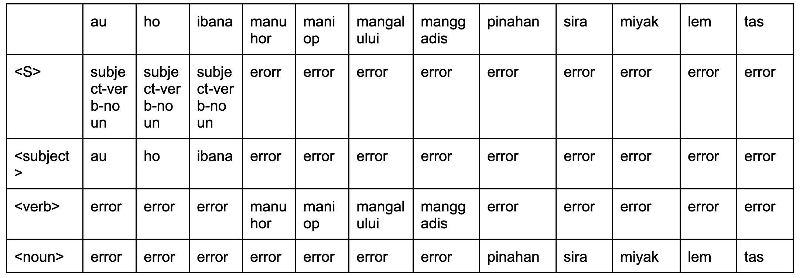
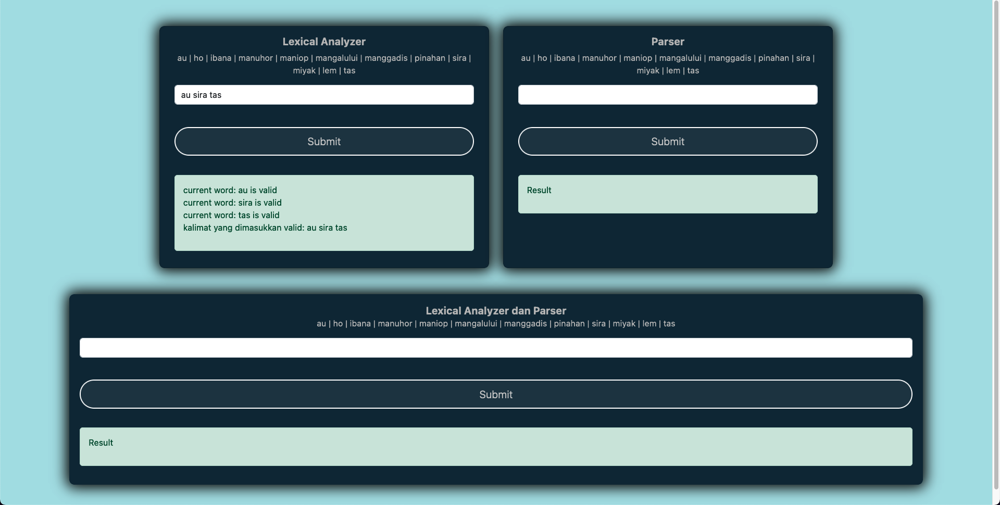

# Final Task Language Theory and Automata

Grammar for the Batak language

```
<S> ::= <subject> <verb> <noun>
<subject> ::= au | ho | ibana
<verb> ::= manuhor | maniop | mangalului | manggadis 
<noun> ::= pinahan | sira | miyak | lem | tas
```

Finite automata design from grammar for program



Table parser for the program



## Design webpage



you can access [here](https://raw.githack.com/haikalvidya/lta-final-task/main/index.html)